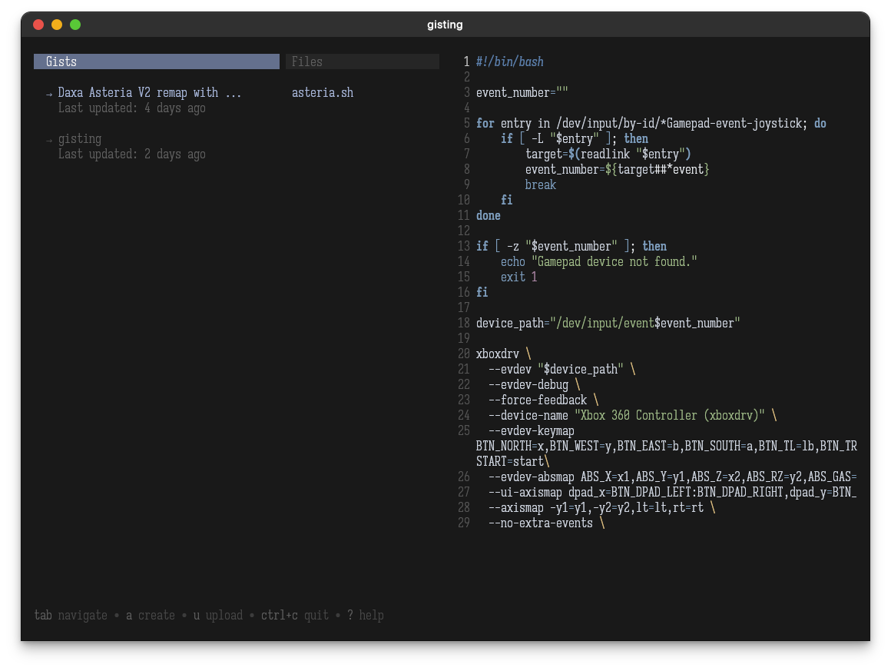

# gisting

<p align="center">
    </img>
</p>

An interactive gist management inside the terminal that you can use to
upload content to https://gist.github.com/.

## Installation

Download the binary from [Github Releases](https://github.com/dimfu/gisting/releases) and drop it in your $PATH.

Or you can just install it with Go:

```bash
go install github.com/dimfu/gisting@latest
```

> [!IMPORTANT]
> Before you start using gisting for the first time you will need to be authenticated.
> You're gonna need to create your personal classic token [here](https://github.com/settings/tokens/new)
> And make sure to tick the gist scope.

## Usage

To launch the interactive interface:

```bash
gisting

# To enable vim motion for the editor (recommended)
gisting -vm
```

### Command Line Usage

To create a new gist you can do:

```bash
# Single file upload
gisting create a.go

# Multiple files
gisting create a.go b.go
gisting create *.go
```

If you'd like to create from your current clipboard content:

```bash
gisting create -P
```

To delete your gist:

```bash
gisting delete [GIST_ID] [FILE_NAME]
```

To list your uploaded and draft gists:

```bash
gisting list
```

You can change the TUI theme by using:

```bash
gisting -t [THEME_NAME]
```

For now, you are limited to changing the theme to one listed on the
[Chroma Style Gallery](https://xyproto.github.io/splash/docs/index.html)

See `gisting help` for more detailed command usages.

## Acknowledgements

- [nap](https://github.com/maaslalani/nap) for the huge inspiration.
- [gist](https://github.com/defunkt/gist).
